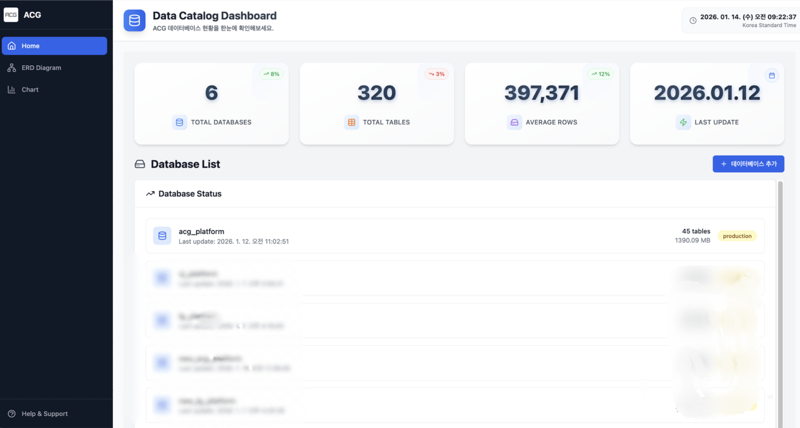
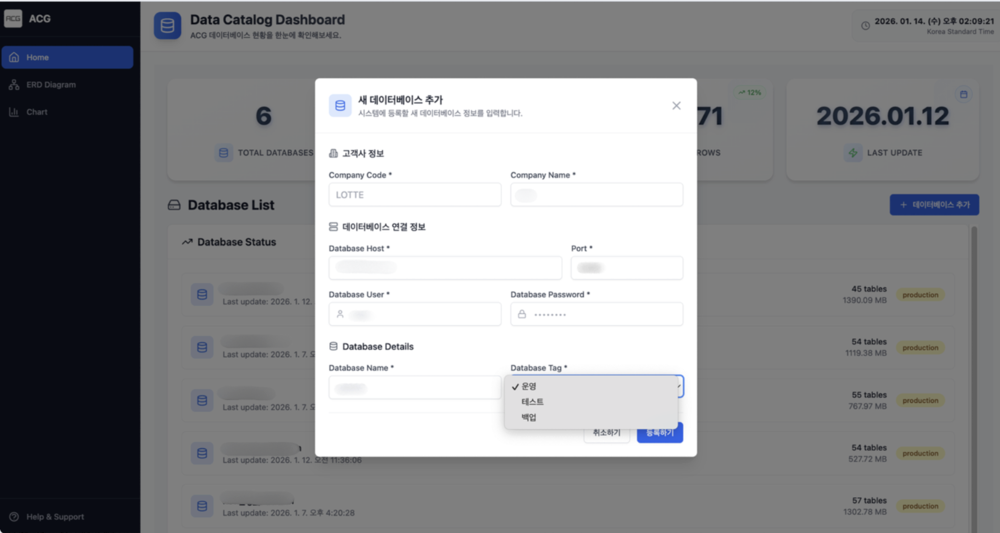
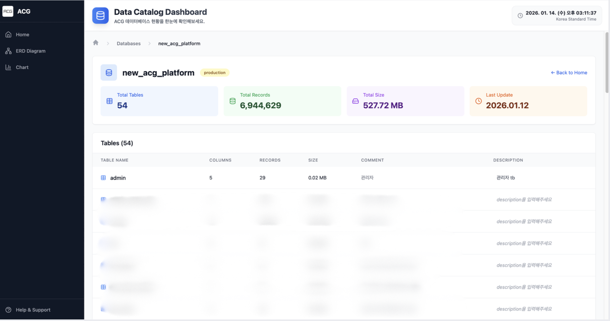
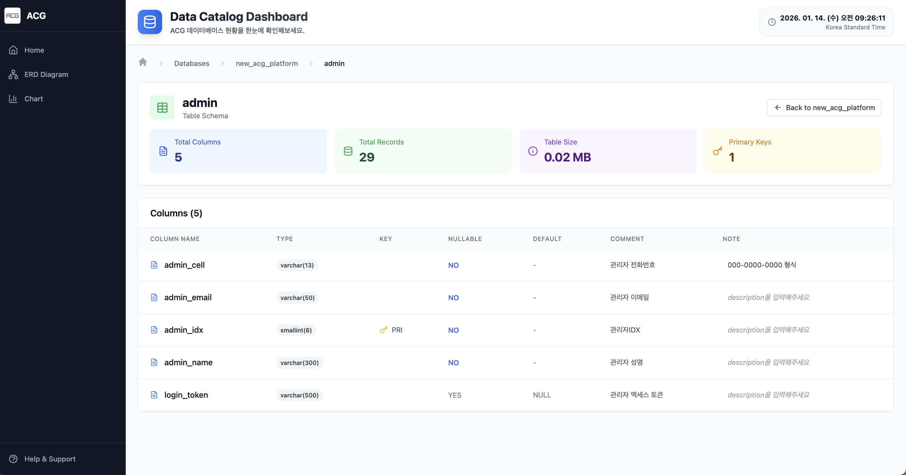
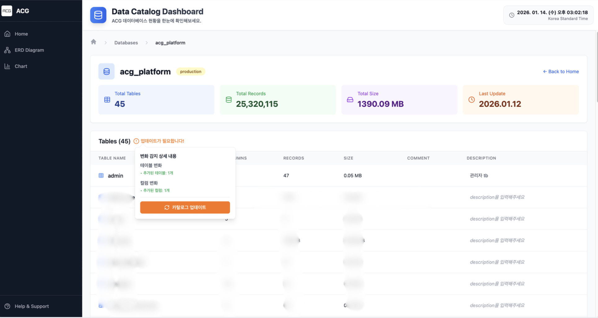
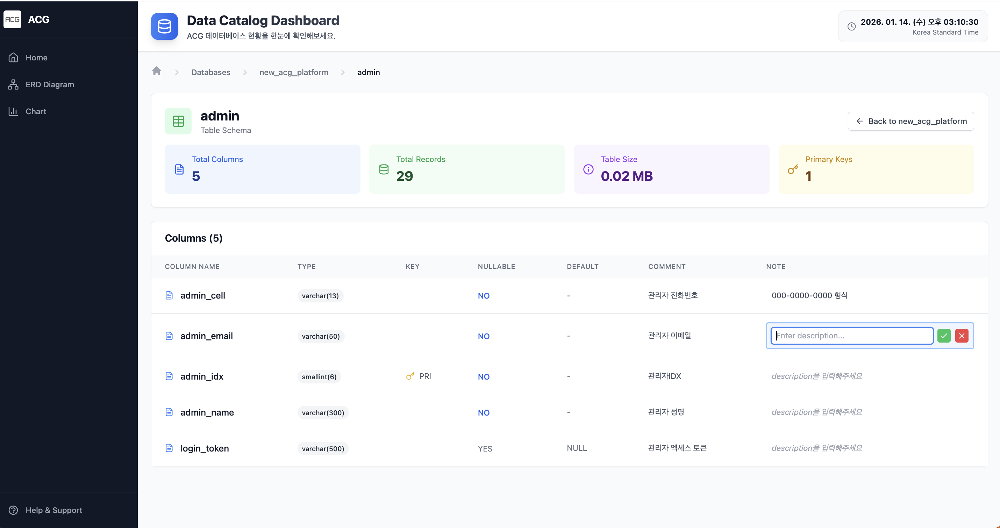
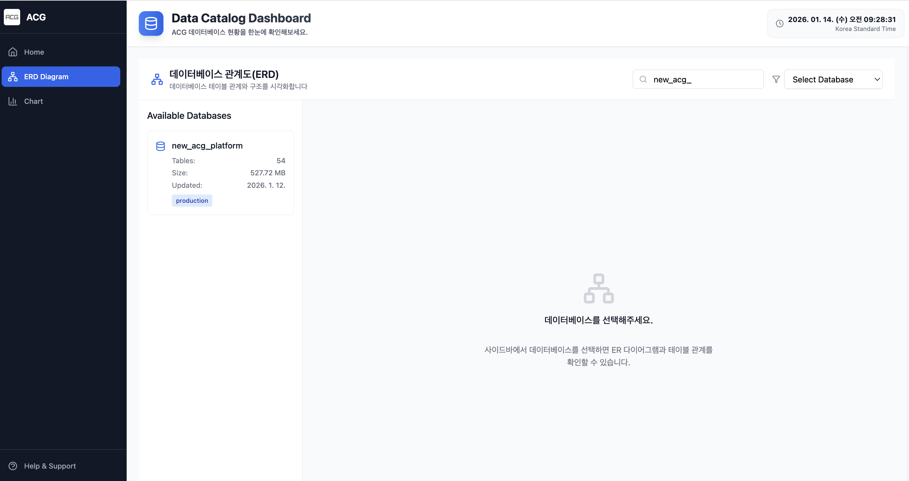
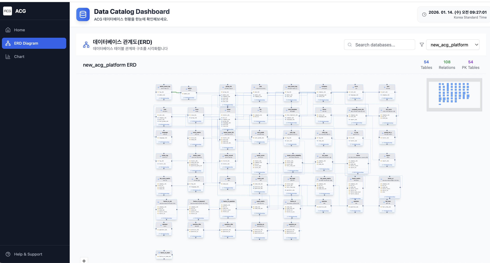
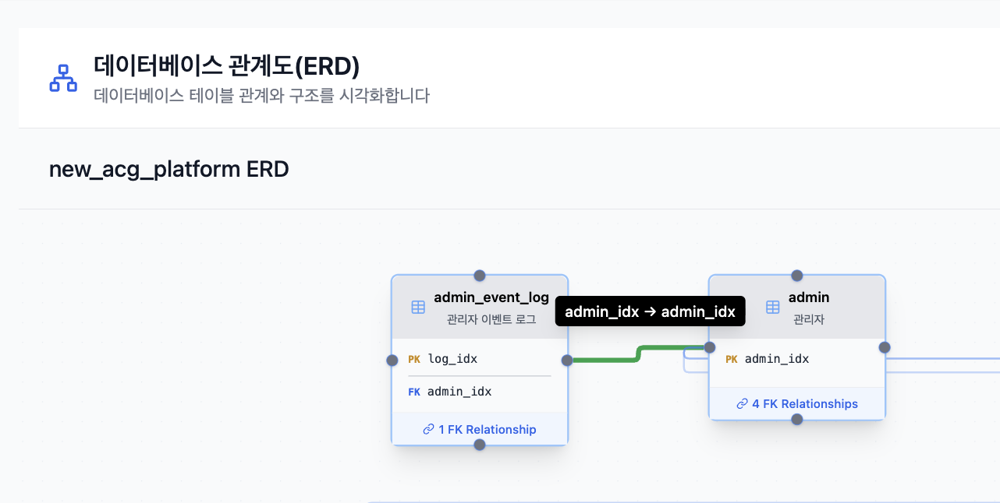

# 📊 데이터 카탈로그 관리 시스템

> MySQL 데이터베이스의 스키마 정보를 자동으로 수집하고 변경을 추척하며,  
> ERD로 시각화까지 제공하는 데이터 관리 플랫폼입니다.

회사의 데이터베이스는 계속 변화합니다. 테이블이 추가되고, 컬럼이 수정되고, 관계가 복잡해집니다. 개발자는 **"이 컬럼은 무엇이고 어디에 사용되지?"** , **"이 테이블은 무엇과 연결되어 있지?"** 라는 질문에 답하기 위해 매번 DB에 접속해서 확인해야 합니다.

테이블 명세서는 회사의 데이터 구조를 빠르게 이해하고 유지보수와 협업을 효율적으로 진행하기 위한 핵심 문서입니다. 하지만 데이터베이스가 변경될 때마다 이를 수동으로 업데이트/관리하는 작업은 시간이 많이 소요되고 실수로 누락되는 경우가 발생하기 쉽습니다.

이 프로젝트는 **MySQL의 information_schema를 조회하여 스키마 정보를 자동으로 수집하고, Firestore에 저장하여 웹에서 쉽게 조회할 수 있도록 구현한 데이터 카탈로그 관리 시스템**입니다. **테이블 명세서 작성을 자동화하여 최신 상태를 유지하고 문서화 부담을 줄이는 것이 주요 목적**입니다.

초기에는 Google Sheets API와 Python을 활용한 자동화를 시도했으나, API 사용량 제한으로 인해 현재 구조로 프로젝트 방향을 전환했습니다.  
▶️ [Google Sheet API를 이용한 테이블 명세서 생성 자동화 바로가기](https://velog.io/@snghyun331/data-catalog-google-sheet-api)

---

## 📸 주요 화면

### Catalog

<table>
  <tr>
    <td align="center" style="font-size: 9px;">
      <br/>
      홈 화면 (Database Catalog)
    </td>
    <td align="center" style="font-size: 9px;">
      <br/>
      데이터베이스 추가
    </td>
  </tr>
  <tr>
    <td align="center" style="font-size: 9px;">
      <br/>
      DB 내 테이블 관리 (Table Catalog)
    </td>
    <td align="center" style="font-size: 9px;">
      <br/>
      Table 내 컬럼 관리 (Column Catalog)
    </td>
  </tr>
  <tr>
    <td align="center" style="font-size: 9px;">
      <br/>
      스키마 변경 자동 감지
    </td>
    <td align="center" style="font-size: 9px;">
      <br/>
      부가 설명 작성
    </td>
  </tr>
</table>

### ERD

<table>
  <tr>
    <td align="center" style="font-size: 9px;">
      <br/>
      ERD 홈 화면
    </td>
    <td align="center" style="font-size: 9px;">
      <br/>
      DB별 ERD 조회
    </td>
    </td>
  </tr>
  <tr>
    <td align="center" style="font-size: 9px;">
      <br/>
      테이블 간 관계 정보 확인
  </tr>
</table>

---

## 🛠 기술 스택 및 선택 이유

### Backend Framework

**NestJS** + **TypeScript**

- **왜 NestJS인가?:** 가장 큰 이유는 회사에서 사용하는 주력 프레임워크이기 때문입니다. NestJS가 제공하는 DI와 모듈 시스템을 활용해 계층을 명확히 분리할 수 있었고, 복잡한 비즈니스 로직을 관리하기에 적합하다고 판단했습니다.
- **TypeScript의 필요성:** 타입 안정성은 단순한 편의를 넘어 협업의 기반이라고 생각합니다. DTO, Interface, 타입 선언을 적극적으로 활용해 런타임 에러를 줄이고 코드의 의도를 보다 명확하게 전달할 수 있었습니다.

### Database

**Firebase Firestore** (메타데이터 저장소) + **MySQL** (회사 DB)

MySQL은 실제 운영 중인 데이터베이스이며, `information_schema`를 조회하여 스키마 정보를 가져옵니다. Firestore는 **수집한 스키마 정보**와 **사용자가 추가한 설명**을 저장하는 용도입니다. 관계형 DB는 스키마가 고정적이지만 메타데이터는 유연한 구조가 필요하기 때문에 NoSQL을 선택했습니다.

- **Firestore를 선택한 이유:** 서브컬렉션 구조(`databases/{dbName}/tables/{tableName}/columns/{columnName}`)로 DB → 테이블 → 컬럼의 계층 관계를 유연하게 저장할 수 있습니다. MongoDB와 비교했을 때, Firestore는 별도 서버 관리 없이 Firebase Admin SDK로 바로 시작할 수 있어 초기 설정이 간편했고 서브컬렉션 방식이 중첩 배열보다 계층 구조를 표현하기에 더 직관적이었습니다.
- **여러 고객사의 DB를 하나의 시스템으로 관리:** 하나의 서버가 여러 고객사의 MySQL DB를 동시에 관리합니다. 각 고객사의 DB 접속 정보(host, port, user, password)는 Firestore에 분리 저장하고, 고객사별 Connection Pool을 캐싱하여 매번 새로운 연결을 생성하지 않도록 했습니다. 따라서 새로운 고객사가 추가될 때마다 서버를 재시작할 필요 없이 DB 연결 정보만 추가하면 즉시 해당 고객사 DB의 스키마를 수집할 수 있습니다.

### Infrastructure & Tools

- **Docker Compose:** NestJS 백엔드, React(Vite) 프론트엔드를 컨테이너로 구성하여 Dev 환경과 Production 환경의 일관성을 유지했습니다.
- **Winston:** 로그 관리는 장애 대응의 핵심입니다. 일별 로그 로테이션과 레벨별 분류로 개발 환경에서의 디버깅을 효율화했습니다.
- **crypto-js:** DB 비밀번호를 Firestore에 저장할 때 AES 암호화하여 보안을 강화했습니다.

### Frontend Framework

**React** + **Vite**

- **Next.js 대신 Vite을 선택한 이유:** 프론트엔드는 가볍게 구성하고 싶었습니다. 설정이 단순하고 빌드 속도가 더 빨라 빠르게 개발할 수 있었습니다.

---

## 🚘 실행 방법

### 1. 환경 변수 설정

`api/.env` 파일을 생성합니다.

```bash
SERVER_PORT=

REDIS_HOST=
REDIS_PORT=

# Firebase Admin SDK (Firebase Console에서 발급)
FIREBASE_TYPE=
FIREBASE_PROJECT_ID=
FIREBASE_PRIVATE_KEY_ID=
FIREBASE_PRIVATE_KEY=
FIREBASE_CLIENT_EMAIL=
FIREBASE_CLIENT_ID=
FIREBASE_AUTH_URI=
FIREBASE_TOKEN_URI=
FIREBASE_AUTH_PROVIDER_X509_CERT_URL=
FIREBASE_CLIENT_X509_CERT_URL=

# AES 키 (DB 비밀번호 암호화용)
AES_SECRET_KEY=
```

`client/.env` 파일을 생성합니다.

```bash
CLIENT_PORT=
VITE_API_BASE_URL=
```

루트 디렉토리에 `.env` 파일을 생성합니다.

```bash
SERVER_PORT=
CLIENT_PORT=
```

### 2. Docker Compose 실행

```bash
# 이미지 빌드 및 실행
docker compose up -d --build
```

<br>

서버가 정상적으로 실행되면,

- Swagger 문서: `http://localhost:{SERVER_PORT}/api`
- 클라이언트: `http://localhost:{CLIENT_PORT}`

---

## 💡 시스템 구조 및 핵심 기능 소개

### 시스템 구조

**Firebase 모듈**(Firestore 저장소 역할)과 **Catalog 모듈**(비즈니스 로직)을 분리하여 각 모듈이 독립적으로 동작하도록 설계했습니다.

```
api/src/
├── module/
│   ├── catalog/                  # 카탈로그 관리
│   │   ├── catalog.controller.ts
│   │   ├── catalog.service.ts     # 스키마 수집, 비교, ERD 생성
│   │   ├── repository/
│   │   │   └── catalog.repository.ts  # MySQL 쿼리
│   │   ├── dto/                   # API 요청/응답 DTO
│   │   └── interface/             # 타입 정의
│   ├── firebase/                  # Firestore 관리
│   │   └── firebase.service.ts
│   ├── redis/                     # Redis 서비스
│   ├── dashboard/                 # 대시보드 통계
│   ├── company/                   # 고객사 관리
│   └── scheduler/                 # 스케줄 작업
├── common/
│   ├── filter/                    # 전역 예외 필터
│   ├── interceptor/               # 응답 포맷 인터셉터
│   ├── middleware/                # 로깅 미들웨어
│   └── utils/                     # 암호화 유틸리티
└── config/
    ├── db.config.ts               # MySQL 연결 설정
    ├── firebase.config.ts         # Firebase Admin SDK 설정
    ├── redis.config.ts            # Redis 설정
    └── logger.config.ts           # Winston 로그 설정
```

### Firestore 데이터 구조

```
Firestore
├── dbConnections/{companyCode}           # DB 연결 정보
│   ├── host, port, dbUser, dbName
│   ├── dbPw                              # AES 암호화된 비밀번호
│
└── databases/{dbName}                    # DB 메타데이터
    ├── companyCode, companyName
    ├── dbSize, totalRows, lastUpdated
    ├── tableList[], dbTag
    │
    └── tables/{tableName}                # 서브컬렉션
        ├── rows, columns, size
        ├── comment, description
        │
        └── columns/{columnName}          # 서브컬렉션
            ├── type, nullable, default
            ├── key, comment, note
```

### 핵심 기능 상세

#### 1. **여러 고객사의 카탈로그 동시 관리**

이 시스템의 핵심 특징은 하나의 서비스가 여러 고객사의 데이터 카탈로그를 동시에 관리한다는 점입니다.

**구현 포인트:**

- Firestore `dbConnections/{companyCode}` 컬렉션에 각 고객사의 DB 접속 정보를 저장합니다. 비밀번호는 crypto-js의 AES 알고리즘으로 암호화하여 저장하고, 조회 시 복호화하여 사용합니다.
- `CatalogRepository`에서 고객사별 Connection Pool을 Map 자료구조(`Map<string, Pool>`)로 캐싱합니다. 처음 요청 시 Pool을 생성하고 캐시에 저장한 뒤, 이후 요청에서는 캐시된 Pool을 재사용하여 DB 연결 오버헤드를 최소화했습니다.
- 고객사가 추가될 때마다 DB 연결 정보만 Firestore에 추가하면 즉시 해당 고객사의 스키마 정보를 수집할 수 있습니다.

<details>
<summary><u>코드 보기</u></summary>

```typescript
// catalog.repository.ts
private poolCache: Map<string, Pool> = new Map();

async getConnectionToDB(companyCode: string): Promise<PoolConnection> {
  const pool = await this.getPool(companyCode);
  return pool.getConnection();
}

private async getPool(companyCode: string): Promise<Pool> {
  if (!this.poolCache.has(companyCode)) {
    const dbConfig = await this.connectDBConfig.getDBConfig(companyCode);
    const pool = createPool({
      host: dbConfig.host,
      port: dbConfig.port,
      user: dbConfig.userName,
      password: dbConfig.password,  // 복호화된 비밀번호
      database: dbConfig.dbName,
      waitForConnections: true,
      connectionLimit: 10,
      queueLimit: 0,
    });
    this.poolCache.set(companyCode, pool);
  }
  return this.poolCache.get(companyCode)!;
}
```

</details>

#### 2. **스키마 수집: information_schema 쿼리 활용**

MySQL의 `information_schema`쿼리는 데이터베이스 자체에 대한 메타데이터를 제공하는 쿼리입니다. 이 프로젝트에서는 세 가지 테이블을 활용하여 스키마 정보를 수집합니다.

**구현 포인트:**

- `TABLES` 테이블에서 테이블명, 행 수, 데이터 크기, 테이블 comment를 조회합니다.
- `COLUMNS` 테이블에서 컬럼명, 타입, Nullable 여부, 기본값, 키 정보, 컬럼 comment를 조회합니다.
- `KEY_COLUMN_USAGE` 테이블에서 Primary Key와 Foreign Key 관계를 조회하여 ERD 생성에 활용합니다.

<details>
<summary><u>쿼리 보기</u></summary>

```typescript
// catalog.repository.ts
async getMasterCatalogInDb(dbName: string, connection: PoolConnection) {
  const query = `
    SELECT
      TABLE_SCHEMA, TABLE_NAME, TABLE_ROWS, TABLE_COMMENT,
      ROUND((DATA_LENGTH / 1024 / 1024), 2) as DATA_SIZE
    FROM information_schema.TABLES
    WHERE TABLE_SCHEMA = '${dbName}'
    ORDER BY TABLE_NAME
  `;
  const [rows] = await connection.query(query);
  return rows;
}

async getTableCatalogInDb(dbName: string, connection: PoolConnection) {
  const query = `
    SELECT
      TABLE_SCHEMA, TABLE_NAME, COLUMN_NAME, COLUMN_DEFAULT,
      IS_NULLABLE, COLUMN_TYPE, COLUMN_KEY, COLUMN_COMMENT
    FROM information_schema.COLUMNS
    WHERE TABLE_SCHEMA = '${dbName}'
    ORDER BY TABLE_NAME
  `;
  const [rows] = await connection.query(query);
  return rows;
}

async getForeignKeyRelations(dbName: string, connection: PoolConnection) {
  const query = `
    SELECT
      TABLE_NAME, COLUMN_NAME, CONSTRAINT_NAME,
      REFERENCED_TABLE_NAME, REFERENCED_COLUMN_NAME
    FROM information_schema.KEY_COLUMN_USAGE
    WHERE TABLE_SCHEMA = '${dbName}'
      AND REFERENCED_TABLE_NAME IS NOT NULL
    ORDER BY TABLE_NAME, COLUMN_NAME
  `;
  const [rows] = await connection.query(query);
  return rows;
}

async getPrimaryKeys(dbName: string, connection: PoolConnection) {
  const query = `
    SELECT
      TABLE_NAME, COLUMN_NAME, CONSTRAINT_NAME
    FROM information_schema.KEY_COLUMN_USAGE
    WHERE TABLE_SCHEMA = '${dbName}'
      AND CONSTRAINT_NAME = 'PRIMARY'
    ORDER BY TABLE_NAME, ORDINAL_POSITION
  `;
  const [rows] = await connection.query(query);
  return rows;
}
```

</details>

#### 3. **스키마 변경 감지 (Diff)**

MySQL(운영 DB)과 Firestore(카탈로그)에 저장된 스키마를 비교(diff)하여, 추가/삭제/수정 된 테이블과 컬럼을 감지합니다.

**구현 포인트:**

- MySQL에서 현재 스키마를 조회하고, Firestore에 저장된 스키마를 불러와 `compareSchemas` 함수로 비교합니다.
- 테이블 추가/삭제, 컬럼 추가/삭제, 컬럼 타입 변경, Nullable 여부 변경을 감지합니다.
- 변경 사항을 `{ changed: boolean, tables: {...}, columns: {...} }` 형태로 구조화하여 반환합니다.

<details>
<summary><u>코드 보기</u></summary>

```typescript
// catalog.service.ts
private compareSchemas(newSchema: TableColumns[], oldSchema: TableColumns[]) {
  const result = {
    changed: false,
    tables: { changed: false, added: [], deleted: [] },
    columns: { changed: false, added: [], deleted: [], updated: [] }
  };

  const oldTables = this.groupByTableName(oldSchema);
  const newTables = this.groupByTableName(newSchema);
  const allTableNames = Array.from(
    new Set([...Object.keys(oldTables), ...Object.keys(newTables)])
  );

  allTableNames.forEach((tableName) => {
    const oldColumns = oldTables[tableName] || [];
    const newColumns = newTables[tableName] || [];

    // 테이블 추가/삭제 감지
    if (oldColumns.length === 0 && newColumns.length > 0) {
      result.tables.added.push({ table: tableName });
      result.tables.changed = true;
      result.changed = true;
    }
    if (newColumns.length === 0 && oldColumns.length > 0) {
      result.tables.deleted.push({ table: tableName });
      result.tables.changed = true;
      result.changed = true;
    }

    // 컬럼 추가/삭제/수정 감지
    const oldColNames = oldColumns.map((col) => col.COLUMN_NAME);
    const newColNames = newColumns.map((col) => col.COLUMN_NAME);

    const added = newColNames.filter((name) => !oldColNames.includes(name));
    const deleted = oldColNames.filter((name) => !newColNames.includes(name));
    const updated = newColNames.filter((name) => {
      const oldCol = oldColumns.find((c) => c.COLUMN_NAME === name);
      const newCol = newColumns.find((c) => c.COLUMN_NAME === name);
      return oldCol && newCol &&
        (oldCol.COLUMN_TYPE !== newCol.COLUMN_TYPE ||
         oldCol.IS_NULLABLE !== newCol.IS_NULLABLE);
    });

    if (added.length > 0) {
      result.columns.added.push({ table: tableName, columns: added });
      result.columns.changed = true;
      result.changed = true;
    }
    if (deleted.length > 0) {
      result.columns.deleted.push({ table: tableName, columns: deleted });
      result.columns.changed = true;
      result.changed = true;
    }
    if (updated.length > 0) {
      result.columns.updated.push({ table: tableName, columns: updated });
      result.columns.changed = true;
      result.changed = true;
    }
  });

  return result;
}
```

</details>

#### 4. **스키마 업데이트**

감지된 변경 사항을 Firestore에 반영합니다. 업데이트 시, 기존에 사용자가 작성한 `description`(테이블 설명 - 수기 작성), `note`(컬럼 설명 - 수기 작성)가 사라지지 않도록 구현했습니다.

**구현 포인트:**

- 삭제된 테이블과 컬럼을 먼저 처리한 후, 추가/수정된 정보를 업데이트합니다.
- MySQL에서 조회한 최신 정보(`rows`, `columns`, `size`, `comment`, `type`, `nullable` 등)는 업데이트하되, 사용자가 수기 작성한 데이터는 보존하여 데이터 손실을 방지했습니다.

<details>
<summary><u>코드 보기</u></summary>

```typescript
// catalog.service.ts
private async updateTablesAndColumns(
  dbName: string,
  masterRows: any[],
  tableRows: any[],
  tableColumnCount: Record<string, number>,
): Promise<void> {
  const columnsByTable = this.groupColumnsByTable(tableRows);

  await Promise.all(
    masterRows.map(async (masterRow: any) => {
      const tableName = masterRow.TABLE_NAME;
      const key = `${masterRow.TABLE_SCHEMA}.${tableName}`;

      // 기존 테이블 정보 조회 (description 유지용)
      const existingTable = await this.firebaseService.getTable(dbName, tableName);

      const tableDoc: TableDoc = {
        rows: masterRow.TABLE_ROWS,           // MySQL 최신 정보
        columns: tableColumnCount[key] || 0,  // MySQL 최신 정보
        size: Number(masterRow.DATA_SIZE),    // MySQL 최신 정보
        comment: masterRow.TABLE_COMMENT || '',  // MySQL 최신 정보
        description: existingTable?.description || '',  // 기존 값 유지
      };
      await this.firebaseService.saveTable(dbName, tableName, tableDoc);

      // 컬럼 업데이트
      const columns = columnsByTable[tableName] || [];
      await Promise.all(
        columns.map(async (col: any) => {
          // 기존 컬럼 정보 조회 (note 유지용)
          const existingColumn = await this.firebaseService.getColumn(
            dbName,
            tableName,
            col.COLUMN_NAME
          );

          const columnDoc: ColumnDoc = {
            type: col.COLUMN_TYPE,
            nullable: col.IS_NULLABLE,
            default: col.COLUMN_DEFAULT,
            key: col.COLUMN_KEY,
            comment: col.COLUMN_COMMENT || '',
            note: existingColumn?.note || '',  // 기존 값 유지
          };
          await this.firebaseService.saveColumn(
            dbName,
            tableName,
            col.COLUMN_NAME,
            columnDoc
          );
        }),
      );
    }),
  );
}
```

</details>

#### 5. **ERD 시각화: Foreign Key 관계 추출**

ERD를 생성하기 위해 `information_schema.KEY_COLUMN_USAGE` 테이블에서 Primary Key와 Foreign Key 관계를 추출했습니다.

**구현 포인트:**

- Foreign Key 관계를 조회하여 "어떤 테이블의 어떤 컬럼이 다른 테이블의 어떤 컬럼을 참조하는지" 정보를 수집합니다.
- Primary Key 정보를 조회하여 각 테이블의 기본 키를 파악합니다.
- **클러스터링 알고리즘:** 외래키로 연결된 테이블들을 BFS로 탐색하고 같은 클러스터로 그룹화하여, 연관 테이블끼리 가까이 배치했습니다.
- 이 정보를 프론트엔드에 전달하면, 노드(테이블)와 엣지(관계)로 ERD를 시각화할 수 있습니다.

<details>
<summary><u>코드 보기</u></summary>

```typescript
// catalog.service.ts
/* ERD 데이터를 조회하는 함수 */
async getDatabaseERD(dbName: string) {
  const dbData = await this.firebaseService.getDatabase(dbName);
  if (!dbData) {
    throw new Error(`Database를 찾을 수 없습니다: ${dbName}`);
  }

  const companyCode = dbData.companyCode;
  const connection = await this.catalogRepository.getConnectionToDB(companyCode);

  try {
    const [tables, foreignKeys, primaryKeys] = await Promise.all([
      this.catalogRepository.getMasterCatalogInDb(dbName, connection),
      this.catalogRepository.getForeignKeyRelations(dbName, connection),
      this.catalogRepository.getPrimaryKeys(dbName, connection),
    ]);

    const tableNodes = (tables as any[]).map((table: any) => ({
      id: table.TABLE_NAME,
      name: table.TABLE_NAME,
      comment: table.TABLE_COMMENT || '',
      rows: table.TABLE_ROWS,
      size: table.DATA_SIZE,
    }));

    const relationships = (foreignKeys as any[]).map((fk: any) => ({
      from: fk.TABLE_NAME,
      to: fk.REFERENCED_TABLE_NAME,
      fromColumn: fk.COLUMN_NAME,
      toColumn: fk.REFERENCED_COLUMN_NAME,
      constraintName: fk.CONSTRAINT_NAME,
    }));

    const primaryKeyMap: Record<string, string[]> = {};
    (primaryKeys as any[]).forEach((pk: any) => {
      if (!primaryKeyMap[pk.TABLE_NAME]) {
        primaryKeyMap[pk.TABLE_NAME] = [];
      }
      primaryKeyMap[pk.TABLE_NAME].push(pk.COLUMN_NAME);
    });

    const foreignKeyMap: Record<string, any[]> = {};
    (foreignKeys as any[]).forEach((fk: any) => {
      if (!foreignKeyMap[fk.TABLE_NAME]) {
        foreignKeyMap[fk.TABLE_NAME] = [];
      }
      foreignKeyMap[fk.TABLE_NAME].push({
        column: fk.COLUMN_NAME,
        references: `${fk.REFERENCED_TABLE_NAME}.${fk.REFERENCED_COLUMN_NAME}`,
        referencedTable: fk.REFERENCED_TABLE_NAME,
        referencedColumn: fk.REFERENCED_COLUMN_NAME,
        constraintName: fk.CONSTRAINT_NAME,
      });
    });

    return {
      tables: tableNodes,
      relationships,
      primaryKeys: primaryKeyMap,
      foreignKeys: foreignKeyMap,
      dbName,
    };
  } catch (err) {
    this.logger.error(err);
    throw err;
  } finally {
    connection.release();
  }
}
```

</details>

### 아키텍처 설계 원칙

- **계층적 구조:** Controller는 요청/응답만 처리하고, Service는 비즈니스 로직을, Repository는 DB 접근만 담당하는 명확한 책임 분리를 적용했습니다.
- **데이터 암호화:** DB 비밀번호를 Firestore에 저장할 때 crypto-js로 암호화하여 보안을 강화했습니다.
- **전역 예외 처리:** Winston과 통합된 Global Exception Filter를 구현하여 모든 에러를 일별 로그 파일에 기록합니다. `QueryFailedError`를 별도로 캐치하여 MySQL 관련 에러를 명확히 분류하고, IP 주소, 사용자명, 요청 경로, Stack Trace를 함께 로깅합니다.
- **통일된 응답 형식:** 모든 API는 `{ statusCode, message, data }` 형태로 응답하여 프론트엔드에서 일관된 에러 핸들링이 가능하도록 했습니다. Response Interceptor를 통해 자동으로 응답 포맷을 맞춥니다.

---

<div align="right">
  <strong>최종 업데이트:</strong> 2026년 1월 13일
</div>
